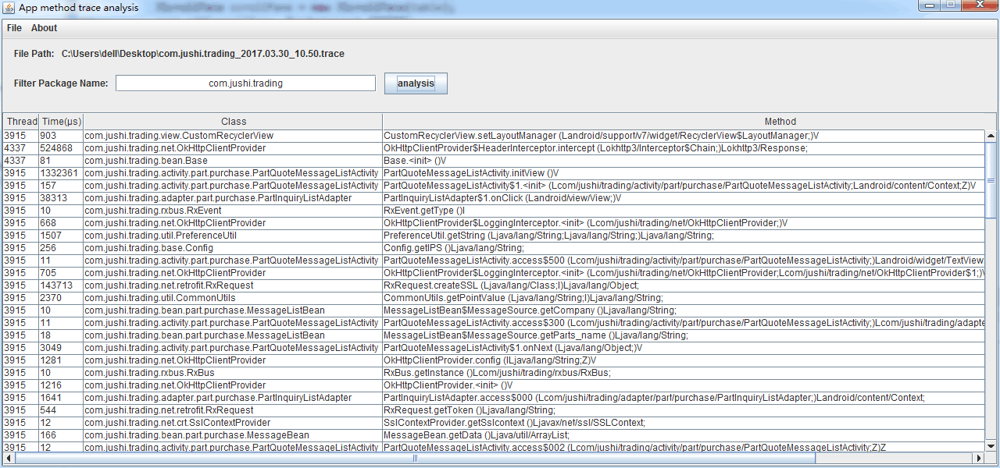

# 分析应用方法耗时的swing工具
> 采用该项目(https://github.com/zjw-swun/AppMethodOrder) 的思路,基于trace文件分析过滤出当前应用(包名)下的方法信息.
# 使用方法
 - 将``sdk\platform-tools``下的dmtracedump添加到系统环境变量
 - 使用tool文件夹下的``MethodTrace.jar`` 直接导入`.trace文件`,一键分析
# 效果图

# 注意点
 - 建议在`jdk 1.8`环境下运行,如是1.7及以下的jdk,请自行修改代码兼容
 - 目前该小工具可使用于Windows平台下,Mac及Linux可自行修改代码兼容(目前无Mac设备，无法测试-_-!)
>Mac下可通过 `java -jar tool/MethodTrace.jar`执行
 - 需先将`dmtracedump`添加至环境变量
 - 方法耗时的单位为`μs`
 - `unknow`意味着该方法未结束调用
# TODO
 - 可视化方法调用图

 # 编译Method_Trace_Tool工程
 
 1. Method_Trace_Tool工程包括编译好的jar包，以及项目源码
 2. MethodTrace目录对应的是一个eclipse工程，可以选择用eclipse开发工具import这个工程，或者是使用IntelliJ IDEA工具open这个工程
 3. 打开工程后，直接在Trace.java类处run main方法即可启动图形化界面
 4. 或者是选择export为jar包的形式,具体可[参考](https://stackoverflow.com/a/9463915/5279354)(idea开发工具)